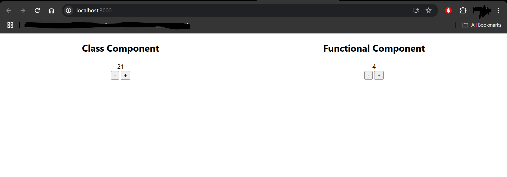

Objective: Create two React components for a counter application:  
Class Component - A counter that increments and decrements when clicking on the "+" and "-" buttons.  

Functional Component - A counter that does the same, using React hooks (useState).  

Submission Guidelines:- Submit your github repo link  
