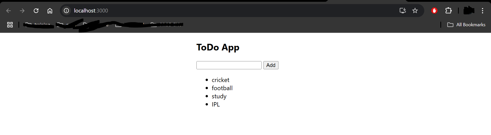

Assignment: Create a To-Do App in React   
Objective: Build a simple To-Do App using React. The app should include an input field to enter the title of a task and an "Add" button that, when clicked, adds the entered task to a list.   
Requirements:   
Title Input Field:   
Provide a text input field where users can type in the title of their to-do task.   
Add Button:   
Create a button labeled "Add" that, when clicked, adds the entered task to the list.   
Display Added Items:   
After clicking the "Add" button, the task should appear below the input field as a part of a to-do list.   
Each item should be displayed as a simple list item (e.g., <li>) on the page.   
State Management:   
Use React state to store:   
The value of the input field (title).   
The list of to-do items (todos).   
UI/UX:   
Display the list of added to-dos below the input field.   
Ensure that each added item is rendered dynamically without reloading the page.   
Validation:   
Ensure that empty or whitespace-only tasks cannot be added to the list.   
Provide some form of user feedback if the input is invalid.   
Submission Guidelines:- Submit your github repo link   

